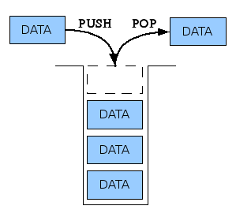

## 스택(Stack)

- 스택은 배열의 끝에서만 데이터를 접근할 수 있는 선형구조이다.
- 스택은 배열의 인덱스 접근이 제한되며, **LIFO(Last In, First Out)** 구조이다.
- 시간복잡도는 모두 `O(1)`이다.

<br>

- 스택의 동작
  - `push` : 스택 맨 끝(맨 위)에 항목을 삽입한다.
  - `pop` : 스택 맨 끝 항목을 반환하는 동시에 제거한다.
  - `top/peek` : 스택 맨 끝 항목을 조회한다.
  - `empty` : 스택이 비어 있는지 확인한다.
  - `size` : 스택 크기를 확인한다.

<br>



<br>
<br>

```cpp
// C++
// 배열을 사용하여 스택 구현하기
#include <stdio.h>
#include <stdlib.h>
#define SIZE 10000
#define INF 9999999

int stack[SIZE];
int top = -1;

void push(int data) {
    if (top == SIZE - 1) {
        printf("스택 오버플로우가 발생했습니다."); // 스택이 가득찼습니다.
        return;
    }
    stack[++top] = data;
}

int pop() {
    if (top == -1) {
        printf("스택 언더플로우가 발생했습니다.");
        return -INF;
    }
    return stack[top--];
}

void show() {
    printf("-- 스택의 최상단 --\n");
    for (int i = top; i >= 0; i--) {
        printf("%d\n", stack[i]);
    }
    printf("-- 스택의 최상단 --\n");
}

int main(void) {
    push(1);
    push(7);
    pop();
    push(2);
    push(3);
    pop();
    push(4);
    push(5);
    push(6);
    show();
    return 0;
}

/*
 -- 스택의 최상단 --
 6
 5
 4
 2
 1
 -- 스택의 최상단 --
*/
```

<br>

배열을 사용하면 메모리 낭비가 생길 수 있다. 이 경우, 연결 리스트를 이용하여 스택을 구현할 수 있다.

```python
class Node:

    """ Node (Container) """

    def __init__(self, value=None, pointer=None):
        self.value = value
        self.pointer = pointer


class Stack:

    """ Stack """

    def __init__(self):
        self.head = None
        self.length = 0

    def is_empty(self):
        return self.length == 0

    def push(self, value):
        self.head = Node(value, self.head)
        self.length += 1

    def pop(self):
        if self.is_empty():
            print("Stack is empty")
        else:
            value = self.head.value
            self.head = self.head.pointer
            self.length -= 1
            return value

    def peek(self):
        if self.is_empty():
            print("Stack is empty")
        else:
            return self.head.value

    def size(self):
        return self.length

    def show(self):
        node = self.head
        while node:
            print(node.value, end=" ")
            node = node.pointer
        print()


if __name__ == "__main__":
    stack = Stack()
    stack.push(1)
    stack.push(2)
    stack.push(3)
    stack.push(4)
    stack.pop()
    print(stack.peek())
    stack.show()

"""
[출력결과]
3
3 2 1
"""
```

<br>

stack 자료구조에서 `O(1)`으로 최솟값을 구할 수 있다.

```python
# 스택에서 최솟값 O(1)로 조회하기

class Node:

    """ Node (Container) """

    def __init__(self, value=None, pointer=None, minimun=None):
        self.value = value
        self.pointer = pointer
        self.minimun = minimun


class Stack:

    """ Stack with minimun """

    def __init__(self):
        self.head = None
        self.length = 0
        self.minimun = 99999

    def is_empty(self):
        return self.length == 0

    def push(self, value):
        if self.is_empty():
            self.head = Node(value, self.head, value)
            self.minimun = value
            self.length += 1
        elif value < self.minimun:
            self.head = Node(value, self.head, value)
            self.minimun = value
            self.length += 1
        else:
            self.head = Node(value, self.head, self.minimun)
            self.length += 1

    def pop(self):
        if self.is_empty():
            print("Stack is empty")
        else:
            value = self.head.value
            self.head = self.head.pointer
            self.minimun = self.head.minimun
            self.length -= 1
            return value

    def peek(self):
        if self.is_empty():
            print("Stack is empty")
        else:
            return self.head.value

    def peek_minimun(self):
        if self.is_empty():
            print("Stack is empty")
        else:
            return self.minimun

    def size(self):
        return self.length

    def show(self):
        node = self.head
        print("-- Stack 최상단 --")
        while node:
            print(node.value, end="\n")
            node = node.pointer
        print("-- Stack 최하단 --")


if __name__ == "__main__":
    stack = Stack()
    stack.push(5)
    stack.push(2)
    stack.push(1)
    stack.push(4)
    stack.push(99)
    print(stack.peek_minimun())
    print(stack.peek())
    stack.pop()
    stack.show()

"""
[출력결과]
1
99
-- Stack 최상단 --
4
1
2
5
-- Stack 최하단 --
"""
```
