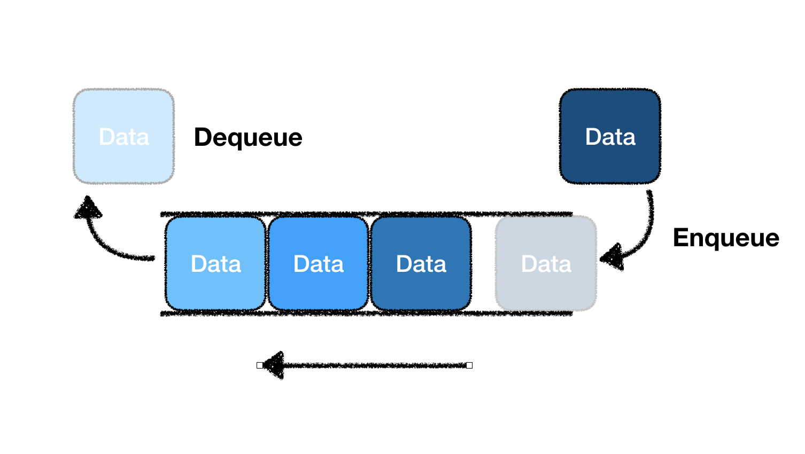

## 큐(queue)

- 큐는 스택과 다르게 데이터가 들어온 순서대로 접근이 가능하다.
- 먼저 들어온 데이터가 먼저 나가는 **FIFO(First In, First Out)** 구조이다.
- 배열의 인덱스 접근이 제한된다.
- 시간복잡도는 모두 O(1)이다.

<br>

- 스택의 동작
  - `enqueue` : 큐 뒤쪽에 데이터를 삽입한다.
  - `dequeue` : 큐 앞쪽의 데이터을 반환하고, 제거한다.
  - `peek/front` : 큐 앞쪽의 데이터를 조회한다.
  - `empty` : 스택이 비어 있는지 확인한다.
  - `size` : 스택 크기를 확인한다.

<br>



<br>
<br>

```python

```
