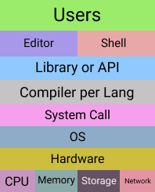

# 운영체제 구조

## 응용 프로그램, 운영체제, 컴퓨터 하드웨어(시스템 리소스) 관계

- **운영체제**는 도서관
- **응용 프로그램**은 시민
- **컴퓨터 하드웨어**는 책(자원)

시민은 도서관에 원하는 책(자원)을 요청하면 도서관은 적절한 책(자원)을 찾아서, 시민에게 빌려준다. 시민은 기한이 다 되면, 도서관이 해당 책(자원)을 회수한다.

**도서관이 있어야 시민이 책을 빌릴 수 있다.**

 

- 운영체제는 응용 프로그램이 요청하는 메모리를 허가하고, 분배한다.
- 운영체제는 응용 프로그램이 요청하는 CPU 시간을 제공한다.
- 운영체제는 응용 프로그램이 요청하는 I/O Devices사용을 허가/제어한다.

 

---

## 운영체제는 사용자 인터페이스를 제공한다.

- 쉘(shell)

  - 사용자가 운영체제 기능과 서비스를 조작할 수 있도록 인터페이스를 제공하는 응용 프로그램
  - 쉘은 터미널 환경(CLI)와 GUI로 분류된다.

 

---

## 운영체제는 응용 프로그램을 위해 API 형태로 인터페이스를 제공한다.

- API (Application Programming Interface)
- 보통 라이브러리 형태로 제공

 

---

## 운영체제는 API가 운영체제 각 기능을 사용할 수 있도록 시스템 콜이라는 명령 또는 함수를 제공

- 시스템 콜 또는 시스템 호출 인터페이스
- API 내부에는 시스템 콜을 호출하는 형태로 만들어지는 경우가 대부분이다.

 
 

---

## 운영체제를 개발한다면?

1. 커널(Kernel)을 개발한다.

2. 시스템 콜을 개발한다.

3. C API를 개발한다.

4. Shell 프로그램을 개발한다.

 

---

## 운영체제와 시스템 콜

- 시스템 콜 표준 정의 예시
  - POSIX API
  - Window API

 

---

> API : 각 언어별 운영체제 기능 호출 인터페이스 함수 (라이브러리)
> 시스템 콜 : 운영체제 기능을 호출하는 함수
