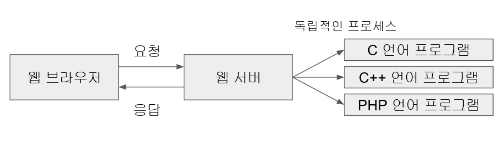
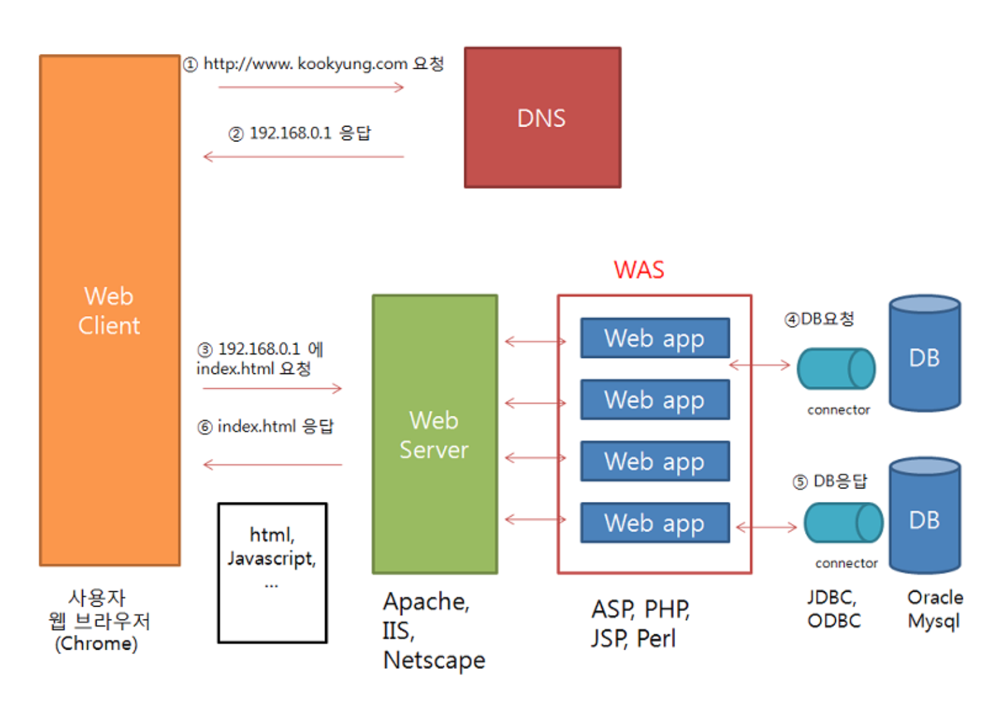

# 웹 프로그래밍의 이해

## 웹 프로그래밍이란

웹 프로그래밍이란, **HTTP 프로토콜로 통신하는 클라이언트와 서버를 개발하는 것이다.** 웹 클라이언트와 웹 서버를 같이 개발할 수도 있고, 웹 클라이언트 또는 웹 서버 하나만 개발할 수도 있다.

<br>

브라우저를 실행하여 구글에 접속하는 것도 웹 프로그램이 동작하는 것이라고 볼 수 있다. 이 경우에는 브라우저가 웹 클라이언트이고, 네이버 서버가 웹 서버가 되는 것이다.

<br>

즉, 웹 클라이언트가 요청하고 웹 서버가 응답하는 클라이언트-서버 프로그램이 동작하는 것이다.

<br>

브라우저 이외에도 웹 서버에 요젗을 보내는 웹 클라이언트는 다양하게 만들 수 있다.

## 웹 브라우저를 사용하여 요청

## 리눅스 `curl` 명령을 사용하여 요청

`$ curl www.google.com`

## 리눅스의 `telnet` 프로그램을 사용하여 요청

## 직접 만든 클라이언트로 요청

```python
import requests

print(requests.get('https://www.google.com').text)
```

<br>

---

<br>

## HTTP 프로토콜

HTTP는 웹 서버와 웹 클라이언트 사이에서 데이터를 주고받기 위해 사용하는 통신 방식으로, TCP/IP 프로토콜 위에서 동작한다.

즉, 웹 서버와 웹 클라이언트는 각각 TCP/IP 동작에 필수적인 IP 주소를 가져야 한다는 것이다.

HTTP란 이름대로라면 하이퍼 텍스트(HyperText) 전송용 프로토콜이지만, 실제로는 HTML이나 XML과 같은 하이퍼 텍스트뿐만 아니라 이미지, 음성, 동영상, 자바스크립트, PDF와 각종 오피스 도큐먼트 파일 등 컴퓨터에서 다룰 수 있는 데이터라면 무엇이든 전송할 수 있다.

<br>

---

<br>

## HTTP 메세지의 구조

HTTP 메세지는 클라이언트에서 서버로 보내는 요청 메세지와 서버에서 클라이언트로 보내는 응답 메세지 2 가지가 있고, 그 구조는 다음과 같다.

| HTTP 메세지의 구조                               |
| ------------------------------------------------ |
| 스타트라인 (Start Line) : 요청라인 또는 상태라인 |
| 헤더 (Header) : 헤더는 생략 가능                 |
| 빈 줄 (Blank Line) : 헤더의 끝을 빈 줄로 식별    |
| 바디 (Body) : 바디는 생략 가능                   |

<br>

**스타트라인**은 요청 메세지인 경우는 요청라인이라고 하고, 응답 메세지인 경우는 **상태라인**이라고 한다.

다음은 바디가 없는 요청 메세지의 예시이다.

```
GET /blog/post/ HTTP/1.1
Host: amamov.com:8080
```

첫 번째 줄은 요청라인으로, **요청 방식**, **요청 URI**, **프로토콜 버전**으로 구성된다.
두 번째 줄은 헤더로, **이름: 값** 형식으로 표현하며, 위 예시의 경우 헤더가 한 줄 뿐이지만 여러 줄도 가능하다.

> URI는 Uniform Resource Identifier의 약자로 URL(Uniform Resource Locator)과 URN(Unoform Resource Name)을 포함하는 좀 더 넓은 의미의 표현이지만, 웹 프로그래밍에서는 URI와 URL을 동일한 의미로 사용해도 무방하다.

Host 항목은 필수로 표시해줘야 하는데, 위 예시처럼 Host 헤더로 표시할 수도 있고, 아래 예시처럼 요청라인의 URI에 Host 헤더는 생략 가능하다.

```
GET http://amamov.com:8080/blog/post/ HTTP/1.1
```

다음은 응답 메세지의 예시이다.

```
HTTP/1.1 200 OK
Content-Type: application/xhtml+xml; charset=utf-8

<html>
...
</html>
```

첫 번째 줄의 상태라인은 **프로토콜 버전**, **상태 코드**, **상태 텍스트**로 구성된다. 서버에서 처리 결과를 상태라인에 표시하는데, 위 예시에서는 `200 OK`이므로 정상적으로 처리되었음을 알 수 있다.

두 번째 줄부터 헤더이다. 위 예시는 헤더 항목이 하나뿐인 응답 메세지로, 이 메세지는 바디를 갖고 있기 때문에 헤더와 바디를 빈 줄로 구분하고 있다. 바디에서는 HTML이 포함되어 있다.

## URL 설계

보통 URL은 다음과 같이 구성된다.

- `https://www.amamov.com:80/service?category=2&kind=patents#n10`
  - `https://` : URL 스킴
  - `www.amamov.com` : 호스트명
  - `:80` : 포트번호
  - `service` : 경로
  - `?category=2&kind=patents#n10` : 쿼리스트링
  - `#n10` : 프라그먼트 (문서 내의 앵커 등 조각을 지정한다.)

URL은 웹 클라이언트에서 호출한다는 시점에서 보면, 웹 서버에 존재하는 애플리케이션에 대한 API라고 할 수 있다. 웹 프로그래밍 기술의 발전 과정을 살펴 보면, 이러한 API의 명명 규칙을 정하는 방법을 두 가지로 분류할 수 있다.

1. URL을 RPC(Remote Procedure Call)로서 바라보는 방식

   - 클라이언트가 네트워크상에서 원격에 있는 서버가 제공하는 API 함수를 호출하는 방식이다.
   - RTC 방식에서는 URL 경로의 대부분이 동사가 된다.

2. URL을 Rest(Representational State Transfer)로서 바라보는 방식

   - 웹 서버에 존재하는 요소들을 모두 리소스라고 정의하고, URL을 통해 웹 서버의 특정 리소스를 표현한다는 개념이다.
   - `https://www.amamov.com:80/service/1`처럼 사용한다.

## 웹 애플리케이션 서버

웹 클라이언트의 요청을 받아서 처리하는 서버를 통칭하여 웹 서버라고 부르기도 하지만, 좀 더 세분화하면 웹 서버와 웹 애플리케이션으로 분류할 수 있다.

- 웹 서버
  - 웹 클라이언트의 요청을 받아서 요청을 처리하고, 그 결과를 웹 클라이언트에게 응답한다.
  - 주로 정적 페이지인 HTML, Image, CSS, JS 파일을 웹 클라이언트에 제공할 때 웹 서버를 사용한다.
  - 만약 동적 페이지 처리가 필요하다면 웹 애플리케이션 서버에 처리를 넘긴다.
  - `Apache httpd`, `Nginx` 등
- 웹 애플리케이션 서버
  - 웹 서버로부터 동적 페이지 요청을 받아서 처리하고, 그 결과를 웹 서버로 반환한다.
  - 주로 동적 페이지 생성을 위한 프로그램 실행과 데이터베이스 연동 기능을 처리한다.
  - `Apache Tomcat`, `JBoss` 등

## 정적 페이지 vs 동적 페이지

정적 페이지란 누가, 언제 요구하더라도 항상 같은 내용을 표시하는 웹 페이지를 의미한다.

정적 페이지들은 항상 웹 서비스의 제공자가 사전에 준비하여 서버 측에 배치한 것으로, 동일한 리소스의 요청에 대해서는 항상 동일한 내용의 페이지를 반환한다. 주로 HTML, JS, CSS, Image로만 이루어진 페이지가 이에 해당된다.

<br>

반면 동적 페이지란 동일한 리소스의 요청이라도 누가, 언제, 어떻게 요구했는지에 따라 각각 다른 내용이 반환되는 페이지를 말한다.

동적 페이지에는 프로그래밍 코드가 포함되어 있어서 페이지 요청 시점에 HTML 문장을 만들어 내는 것이다.

<br>

초창기 웹이 출현했을 때는 논문 열람 사이트와 같이 정적인 웹 페이지들을 하이퍼링크로 연결하여 보여주는 것이 목적이였고, 웹 서버도 정적인 페이지를 보여주는 것이 주된 역할이었다.

그러나 점차 동적 페이지에 대한 요구사항이 생기고, 필요한 데이터를 저장하고 꺼내오는 등의 데이터베이스 처리에 대한 요구가 많아짐에 따라 웹 서버와는 다른 별도의 프로그램이 필요하게 되었다.

이러한 별도의 프로그램과 웹 서버 사이에 정보를 주고잗는 규칙을 정의한 것이 바로 `CGI(Common Gateway Interface)`규격이다.

## CGI

CGI 자체는 정식 프로그래밍 언어나 스크립트가 아니라, 웹 서버와 독립적인 프로그램(프로세스) 사이에 정보를 주고 받는 규격을 의미하며, 이 규격을 준수하면 어떤 언어를 사용해도 CGI 프로그램을 개발할 수 있다.

전통적인 CGI 방식은 아래의 그림과 같이 웹 서버가 C, C++, PHP 등으로 만들어진 CGI 프로그램을 직접 호출하여 개별 프로세스를 생성하는 방식이다.



<br>

**CGI 방식의 근본적인 문제점은 각각의 클라이언트의 요청에 대하여 독립적인 별도의 프로세스가 생성된다는 것이다.**

요청이 많아질수록 프로세스가 많아지고, 프로세스가 많아질수록 비례적으로 프로세스가 점유하는 메모리 요구량도 커져서 시스템에 많은 부하를 주는 요인이 된다.

그래서 현재는 CGI 방식은 거의 사용되지 않고 있으며, 이러한 단점을 해결하기 위해 대안책으로 여러 가지 기술이 등장하였다.

<br>

CGI 방식의 대안 기술 중 하나는 CGI 프로그램과 같은 역할을 하는 별도의 프로그램을 Perl, PHP 등의 스크립트 언어로 작성하고, 스크립트를 처리하는 스크립트 엔진(인터프리터)을 웹 서버에 내장시켜서 CGI 방식의 단점이었던 별도의 프로세스를 기동시키는 오버헤드를 줄이는 방식이다. 아파치 웹 서버에서 사용하는 mod_perl 혹은 mod_php 모듈이 Perl이나 PHP 스크립트 엔진을 웹 서버에 내장시켜 애플리케이션의 처리를 고속화하기 위해 개발된 기술들이다.

파이썬의 경우에는 예전의 mod_python 모듈은 더 이상 사용하지 않고 있으며, 현재는 mod_wsgi 모듈을 사용하고 있다.

<br>

또 다른 방식은 애플리케이션을 처리하는 프로세스를 미리 데몬으로 기동시켜 놓은 후, 웹 서버의 요청을 데몬에서 처리하는 것이다. 이 또한 프로세스 생성 부하를 줄일 수 있는 방법이다. 파이썬의 경우에는 데몬 방식에도 mod_wsgi 모듈을 사용한다. mod_wsgi 모듈은 앞에서처럼 웹 서버 내장 방식으로도 실행이 가능하고, 별도의 데몬 방식으로도 실행이 가능하다.

> 데몬(daemon) 이란 리눅스 시스템이 처음 가동될 때, 실행되는 백그라운드 프로세스의 일종이고 사용자의 요청을 기다리고 있다가 요청이 발생하면 이에 적절히 대응하는 리스너 역할이다. 메모리에 상주하면서 특정 요청이 오면 즉시 대응 할 수 있도록 대기 중인 프로세스.

CGI 애플리케이션을 별도의 데몬으로 처리하는 방식은 기술이 점차 발전함에 따라, 스레드 처리가 보강되고 객체 지향 기술이 반영되면서 애플리케이션 전용 데몬인 **애플리케이션 서버 방식**으로 발전하였다.

## 애플리케이션 서버 방식 (WAS)

애플리케이션 서버 방식은 웹 서버가 직접 프로그램을 호출하기보다는 다음 그림처럼 웹 애플리케이션 서버를 통해서 간접적으로 웹 애플리케이션 프로그램을 실핸한다.

웹 애플리케이션 서버는 애플리케이션 프로그램의 실행 결과를 웹 서버에 전달해주며, 웹 서버는 웹 애플리케이션 서버로부터 전달받은 응답 결과를 웹 클라이언트에 전송한다.


