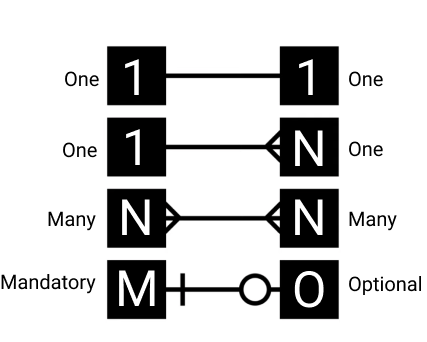
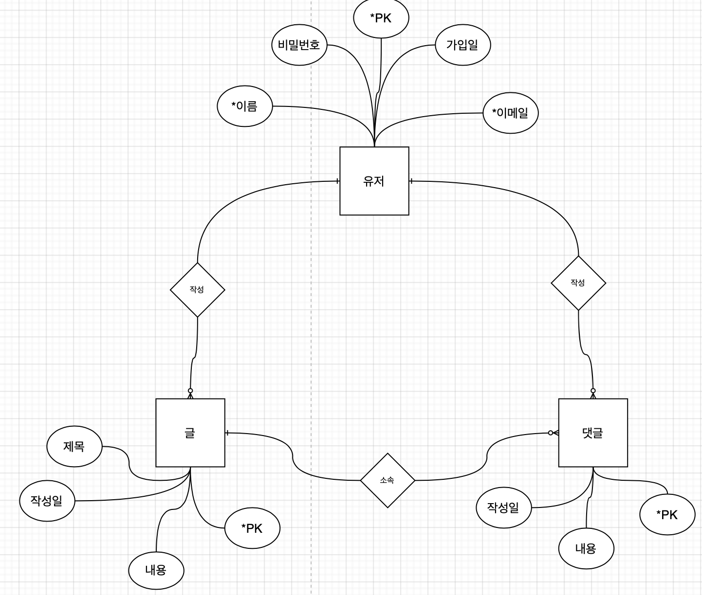
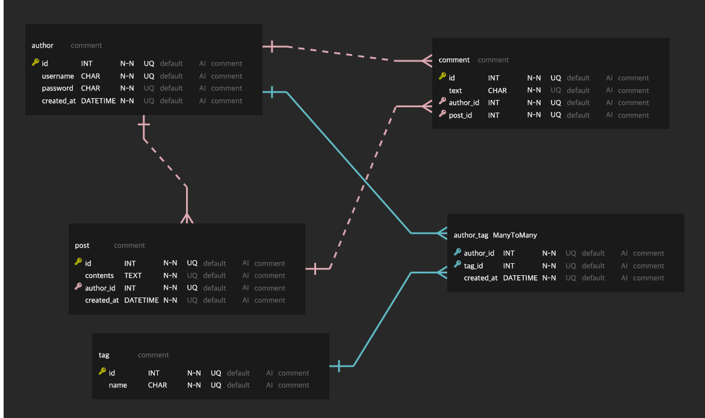

# Database (DB)

## DB의 정의

DB는 데이터를 구조적으로 모아둔 데이터 집합소이다.

- **관계형 데이터베이스 (Relational Database : RDB)**
  - 데이터를 열과 행을 가진 테이블 형태로 표현하며, 구조적으로 데이터 관리를 한다.
- **NoSQL**

 

<b>관계형 데이터베이스 관리 시스템 (RDBMS)</b>는 말 그대로 관계형 데이터베이스를 관리하는 시스템이다.(ex. MySQL, Oracle, PostgreSQL 등) 주요 기능은 데이터 추가, 수정, 삭제, 조회, 데이터 무결성 유지 트랜젝션 관리, 백업 및 복원, 보안 등이 있다. SQL Client Program 또는 각종 언어 (python, java 등)으로 RDBMS에 접근하여 사용할 수 있다.

 

---

 

## SQL (Structured Query Language)

**SQL은 RDBMS의 데이터를 관리하기 위해 설계된 특수 목적의 프로그래밍 언어이다.**

 

---

 

## 데이터 모델링 순서

- 모델은 모형, 축소형이라는 의미로서 다양한 현상에 대해서 일정한 표기법에 의해 표현해 놓은 모형이라고 할 수 있다.

- 데이터 모델링이란 정보시스템을 구축하기 위해, 해당 업무에 어떤 데이터가 존재하는지 또는 업무가 필요로 하는 정보는 무엇인지를 분석하는 방법이다.

### 1. 업무 파악

[UI/UX Tool - Figma](https://www.figma.com)

- 기획서 또는 스토리보드로 정확하게 비지니스 모델을 이해해야 한다.

 

### 2. 개념적 데이터 모델링

- [Model Diagram Tool - Drawio](https://app.diagrams.net)
- Draw.io Integration - VSCode Extension Tool

처음 현실세계에서 추상화 수준의 높은 수준을 형상화하기 위해 개념적 데이터 모델링을 한다. 조직, 사용자의 데이터 요구 사항을 찾고 분석하는 데서 시작하며, 특정 자료의 중요도와 유지 여부를 결정한다. 이 단계에 있어서 핵심은 <b>엔티티(Entity)</b>와 그들 간의 관계를 발견하고, 그것을 표현하기 위해 <b>엔티티-관계 다이어그램(E-R Diagram)</b>을 생성하는 것이다.

**E-R diagram**이란 개념을 모델링하는 것으로 <b>개체(entity)</b>와 <b>속성(attribute)</b>, <b>관계성(relationship)</b>을 표현한다.

> Entity : Table

> Attribute : Column

> Relation : PK, FK

> Tuple : Row

 

 
 

 
 

### 3. 논리적 데이터 모델링

- [erdcloud](https://www.erdcloud.com)
- ERD Editor - VSCode Extension Tool

- **논리 데이터 모델**이란 개념 데이터 모델을 상세화 하여 논리적인 데이터 집합, 관리 항목, 관계를 정의한 모델을 말한다.
- **논리 데이터 모델**은 전체 데이터 구조에서 가장 핵심을 이루는 모델로서 전체 업무 범위와 업무 구성요소를 확인할 수 있다.
- 모든 업무의 데이터 구조를 구체적으로 정의하고 최신의 내용으로 관리될 수 있도록 해야 한다.
- **논리 데이터 모델**은 데이터 구조 정의시 상세하게 정의될 수 있는 모든 정보를 포함해야 하며, 논리 데이터 모델이 구체적이고 상세할수록 업무에서 관리하는 모든 데이터 구조는 상세하게 관리될 수 있다.

 

 
 

### 4. 물리적 데이터 모델링

- **물리 데이터 모델**이란 논리 데이터 모델을 DBMS의 특성 및 성능을 고려하여 구체화시킨 모델을 말한다.

- **물리 데이터 모델**은 DBMS 선정 이후에 해당 DBMS 상에서 최상의 성능을 보장하도록 논리 데이터 모델에서 저장하는 데이터의 물리적 특성을 최대한 반영하여 설계하고 이를 관리한다.

- 논리 데이터 모델이 1:1로 데이터베이스의 객체로 대응되어 생성되지 않으므로 DBMS의 성능을 최대한 살릴 수 있고 저장되는 데이터의 특성을 충분히 반영할 수 있다.
