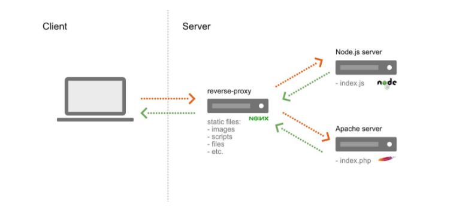

# Reverse Proxy

Ngnix는 Revers Proxy로도 활용할 수도 있다.

Reverse Proxy란 외부 클라이언트에서 서버에 접근 시, **중간에서 중개자 역할을 하여 내부 서버로 접근할 수 있도록 도와주는 서버이다.**

Reverse Proxy를 활용했을 때 얻을 수 있는 장점은 다음과 같다.

- 보안
  - 외부 사용자로부터 내부망에 있는 서버의 존재를 숨길 수 있다.
  - 모든 요청은 리버스 프록시 서버에서 받으며, 매핑되는 내부 서버로 요청을 전달한다.
  - Nginx는 SSL 설정도 가능하다.
- 로드밸런싱
  - 리버스 프록시 서버가 내부 서버에 대한 정보를 알고 있으므로, 각 서버의 상태에 따라 부하를 분산시키며 요청을 전달할 수 있다.
