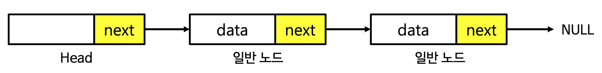
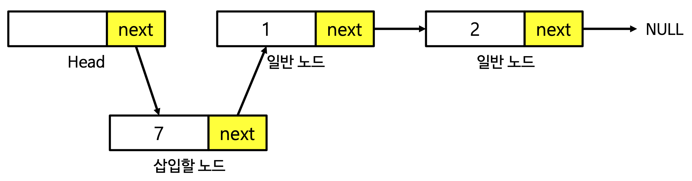
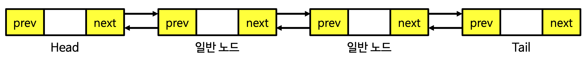

# 연결리스트

떨어진 곳에 존재하는 데이터를 화살표를 연결해서 관리하는 데이터 구조

## 연결리스트의 필요성

일반적으로 배열을 사용하여 데이터를 순차적으로 저장하고, 나열할 수 있다. 하지만 이 경우 메모리 공간이 불필요하게 낭비 될 수 있다.

아래의 코드는 배열에서 앞에 값을 추가하는 함수와 뒤에 값을 추가하는 함수이다.

```cpp
#include <stdio.h>
#define INF 10000 // 무한

int my_arr[INF];
int count = 0;

void add_back(int data) {
    // 배열 뒤에 값을 추가
    my_arr[count] = data;
    count++;
}

void add_first(int data) {
    // 배열 앞에 값을 추가
    for (int i = count; i >= 1; i--) {
        my_arr[i] = my_arr[i - 1];
    }
    my_arr[0] = data;
    count++;
}

void remove_element(int index) {
    // 특정 인덱스의 원소를 제거
    for (int i = index; i <= count; i++) {
        my_arr[i] = my_arr[i+1];
    }
    count--;
}

void show() {
    for (int i = 0; i < count; i++) {
        printf("%d ", my_arr[i]);
    }
    printf("\n");
}

int main(void) {
    add_first(4);
    add_first(5);
    add_first(1);
    add_back(7);
    add_back(6);
    add_back(8);
    remove_element(1);
    show();
    return 0;
}

/*
[출력]
1 5 4 7 6 8
1 4 7 6 8
*/
```

배열은 특정한 위치의 원소에 즉시 접근할 수 있다는 장점이 있다. 하지만 데이터가 들어갈 공간을 미리 메모리에 할당해야 한다는 단점이 있다. 또한 원하는 위치로의 삽입이나 삭제가 비효율적이다.

<br>

## 연결리스트 구현

- **연결 리스트**는 값과 다음 노드에 대한 포인터(참조)가 포함된 노드로 이루어진 선형 리스트다.
- **연결 리스트**는 C언어에서 일반적으로 구조체와 포인터를 함께 사용하여 구현한다.
- 연결 리스트는 리스트의 중간 지점에 노드를 추가하거나 삭제할 수 있어야 한다.
- 필요할 때마다 메모리 공간을 할당 받는다.
- 연결 리스트로 스택과 큐를 구현할 수 있다.


<br>
<br>

단일 연결 리스트는 다음과 같은 형태로 나타낼 수 있다.

- 포인터를 이용해 단방향적으로 다음 노드를 가리킨다.
- 일반적으로 연결 리스트의 시작 노드를 헤드(Head)라고 하며 별도로 관리한다.
- 다음 노드가 없는 끝 노드의 다음 위치 값으로는 NULL을 넣는다.



<br>
<br>

```cpp
#include <stdio.h>
#include <stdlib.h>


struct Node {   // 연결 리스트의 노드 구조체
    int data;   // 데이터를 저장할 멤버
    struct Node *next;  // 다음 노드의 주소를 저장할 포인터
};

int main(void) {
    struct Node *head = (Node*)malloc(sizeof(Node));    // 머리 노드 생성, head에는 값 부여 x
    struct Node *node1 = (Node*)malloc(sizeof(struct Node));   // 첫 번째 노드 생성
    head->next = node1; // head에 다음 node1의 주소를 저장하면서 연결
    node1->data = 1; // 첫 번째 노드에 값 1 부여
    struct Node *node2 = (Node*)malloc(sizeof(struct Node));   // 두 번째 노드 생성
    node1->next = node2; // node2에 다음 node2의 주소를 저장하면서 연결
    node2->data = 2; // 두 번째 노드에 값 2 부여
    node2->next = NULL; // node2가 마지막 node이므로 다음 주소에 NULL 저장
    Node *cur = head->next;
    while (cur != NULL) {
        printf("%d ", cur->data);
        cur = cur->next;
    }
    printf("\n");
    return 0;
}

/*
 [출력]
 1 2
 */
```

<br>

연결 리스트 삽입 과정은 아래와 같다.



<br>
<br>

```cpp
struct Node {   // 연결 리스트의 노드 구조체
    int data;   // 데이터를 저장할 멤버
    struct Node *next;  // 다음 노드의 주소를 저장할 포인터
};

void add_front(Node *root, int data) {
    // root 노드 앞에 새로운 노드를 삽입한다.
    Node *node = (Node*)malloc(sizeof(Node));
    node->data = data;
    node->next = root->next;
    root->next = node;
}
```

<br>

연결 리스트의 요소 제거 과정은 아래와 같다.

```cpp
void remove_front(Node *root) {
    // root 노드의 앞에 있는 노드를 삭제한다.
    Node *front = root->next;
    root->next = front->next;
    free(front);
}
```

<br>

```cpp
#include <stdio.h>
#include <stdlib.h>


struct Node {   // 연결 리스트의 노드 구조체
    int data;   // 데이터를 저장할 멤버
    struct Node *next;  // 다음 노드의 주소를 저장할 포인터
};

void add_front(Node *root, int data) {
    // root 노드 앞에 새로운 노드를 삽입한다.
    Node *node = (Node*)malloc(sizeof(Node));
    node->data = data;
    node->next = root->next;
    root->next = node;
}

void remove_front(Node *root) {
    // root 노드의 앞에 있는 노드를 삭제한다.
    Node *front = root->next;
    root->next = front->next;
    free(front);
}

void free_all(Node *head) {
    // 연결 리스트 메모리 해제
    Node *cur = head->next;
    while (cur != NULL) {
        Node *next = cur->next;
        free(cur);
        cur = next;
    }
}

void show_all(Node *head) {
    Node *cur = head->next;
    while (cur != NULL) {
        printf("%d ", cur->data);
        cur = cur->next;
    }
}

int main(void) {
    struct Node *head = (Node*)malloc(sizeof(Node));    // 머리 노드 생성, head에는 값 부여 x
    struct Node *node1 = (Node*)malloc(sizeof(struct Node));   // 첫 번째 노드 생성
    head->next = node1; // head에 다음 node1의 주소를 저장하면서 연결
    node1->data = 1; // 첫 번째 노드에 값 1 부여
    struct Node *node2 = (Node*)malloc(sizeof(struct Node));   // 두 번째 노드 생성
    node1->next = node2; // node2에 다음 node2의 주소를 저장하면서 연결
    node2->data = 2; // 두 번째 노드에 값 2 부여
    node2->next = NULL; // node2가 마지막 node이므로 다음 주소에 NULL 저장
    remove_front(node1);
    add_front(head, 17);
    show_all(head);
    free_all(head);
    printf("\n");
    return 0;
}

/*
 [출력]
 17 1
 */
```

<br>

## 연결 리스트의 특징

1. 삽입과 삭제가 배열에 비해서 간단하다는 장접이 있다.
2. 배열과 다르게 특정 인덱스로 즉시 접근하지 못하며, 원소를 차례대로 검색해야 한다.
3. 배열보다 데이터 삽입과 삭제가 효율적이다.
4. 추가적인 포인터 변수가 사용되므로 메모리 공간이 낭비된다.

<br>

---

<br>

## 양방향 연결 리스트

- 양방향 연결 리스트는 머리 (Head)와 꼬리(Tail)를 모두 가진다는 특징이 있다.
- 양방향 연결 리스트의 각 노드는 앞 노드와 뒤 노드의 정보를 모두 저장하고 있다.


